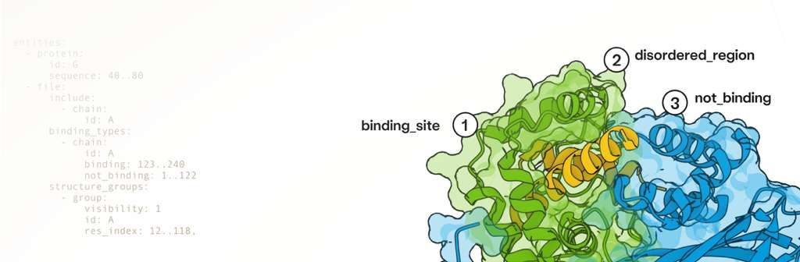

# Boltzgen Local Deployment Process by wrc -- an universal binder design model

本人的第三段项目部分工作，基于 [Boltzgen](https://github.com/HannesStark/boltzgen) 分子生成模型，在实验室的 CentOS 7 服务器上完成从**环境部署 → 靶点配置 → 批量预测**的全流程 Pipeline，对 53 个候选多肽配体进行靶点结合预测筛选。

## 项目概述

Boltzgen 是一个基于等变扩散模型的蛋白质-配体结合分子生成框架。  
本项目将其部署在无 root 权限、Slurm 调度器停用的 CentOS 7 - 10*4090 服务器上，并通过空间位点计算方法批量生成靶点配置文件，实现高通量预测。  

在实践的过程中我掌握了各种技能。包括解决环境依赖问题（认识到底层依赖存在边界），docker/singularity部署方式，huggingface拉取模型权重的网络问题，cuda框架下的显卡调度，服务器与本地交互，批量化处理数据，SLURM/脚本进行批量操作等。

## 技术栈

`Python` `Conda` `Docker` `Singularity` `Bash` `YAML` `OpenMM` `Linux`

## 仓库结构

```
.
├── README.md
├── configs/                    # 53 个蛋白的 YAML 靶点配置
├── scripts/
│   ├── generate_yaml.py        # 基于空间距离的批量 YAML 生成脚本
│   └── batch_run.sh            # 无调度器环境下的批量任务脚本
├── LEADS-PEP_inputfiles/       # 原始蛋白质 PDB 数据 (53 个蛋白)
├── working yamls/                       # BOLTZGEN 运行工作目录
├── deploy/
│   └── DEPLOY.md               # 部署全流程踩坑记录 (Conda→Docker→Singularity→Venv)
└── results/                    # 模型预测结果输出
```

## 工作流

```
原始蛋白 PDB 数据（清洗去水）
    │
    ▼
空间位点分析 (generate_yaml.py)
    │  欧氏距离计算蛋白-配体原子接触位点 (cutoff < 3.0Å)
    │  自动识别主链 & 结合热点残基
    ▼
53 个靶点 YAML 配置文件
    │
    ▼
BOLTZGEN 批量预测 (batch_run.sh)
    │  Singularity 容器 + Venv 次级环境
    │  OPENBLAS/OMP/MKL 线程控制
    ▼
每个蛋白 100 个候选分子设计 → results/
```

## 关键技术挑战与解决方案

### 1. 跨平台模型部署 — Conda → Docker → Singularity 三层迁移

| 尝试 | 方法 | 结果 | 原因 |
|------|------|------|------|
| 1 | Conda/Pip 服务器直接部署 | ❌ | CentOS 7 glibc 2.17 无法编译三角函数驱动 |
| 2 | Docker windows 本地构建 | ⚠️ | 代理条件下拉取权重，模型部署成功，但3060显卡跑不动 |
| 3 | Docker → Singularity 打包迁移 | ❌ | 容器内 Python 包缓存路径冲突 |
| 4 | Singularity + Venv 次级环境 | ✅ | 在容器内创建 venv，export 到工作目录 |

### 2. 空间位点自动识别与批量配置生成

- **问题**：BOLTZGEN 需要为每个蛋白手写 YAML，指定主链 ID、结合位点残基编号、配体链 ID 和序列长度
- **方法**：解析 PDB 原子坐标 → 遍历蛋白-配体原子对 → 3.0Å 欧氏距离判定接触 → 自动提取主链热点残基 → 动态分配配体链 ID → 生成 YAML （还需关注序列偏移的问题，要做对齐）
- **验证**：先在 ViewMol 网站手动标注 1B9J 蛋白靶点，与脚本输出对比，确认一致后批量生成剩余 52 个

### 3. 无调度器环境的批量任务管理

- **问题**：服务器 Slurm 不可用，OpenMP 默认线程数导致资源竞争
- **解决**：手写 Shell 任务队列 + `OPENBLAS_NUM_THREADS=1 OMP_NUM_THREADS=1 MKL_NUM_THREADS=1` 限制线程

```

## 能力映射

| 项目工作 | 体现能力 |
|---|---|
| CentOS 7 glibc 兼容性排查 | Linux 系统诊断、底层依赖分析（conda/pip） |
| Docker → Singularity 容器迁移 | 容器化技术、跨平台部署 |
| Venv 次级环境修复缓存冲突 | Python 环境管理、依赖隔离 |
| 空间位点方法批量生成 YAML | 计算化学背景、PDB 结构解析、Python 自动化 |
| 手写任务队列 + 线程控制 | Shell 编程、HPC 资源管理、并行调试 |


## 原始项目

- [BOLTZGEN](https://github.com/HannesStark/boltzgen) — Hannes Stark et al., "BOLTZGEN: Equivariant Diffusion Models for Structure-Based Drug Design"

## 致谢

感谢 BOLTZGEN 作者开源模型权重与代码。
